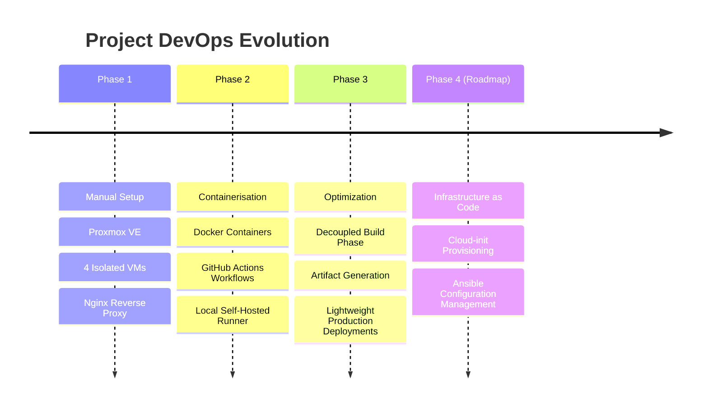

# SamplePhotoApp
Sample Photo App - For Training

## Project Overview & Evolution
The Mission: Built, containerised, and automated a multi-tier web application infrastructure.

## The Growth: 
Evolved the setup from manual Proxmox VMs (Phase 1) to Docker containerisation with GitHub Actions (Phase 2), and finally optimizing it into a decoupled, artifact-based CI/CD pipeline (Phase 3).

## Future Plans
    aunsible → Ansible (Configuration Management / Automation tool)cload-init 
    Cloud-init (Industry-standard multi-distribution drive initialization)easly recreatable sample
    Highly reproducible, immutable infrastructure or automated provisioning template

## Key Takeaways & Engineering Challenges
    Challenge: Overcoming network routing complexities between Proxmox VMs.
    Challenge: Securing and configuring the local self-hosted GitHub runner.
    Optimisation: Why Phase 3 is better than Phase 2 (e.g., smaller image sizes, faster build times, decoupled build/production environments).

