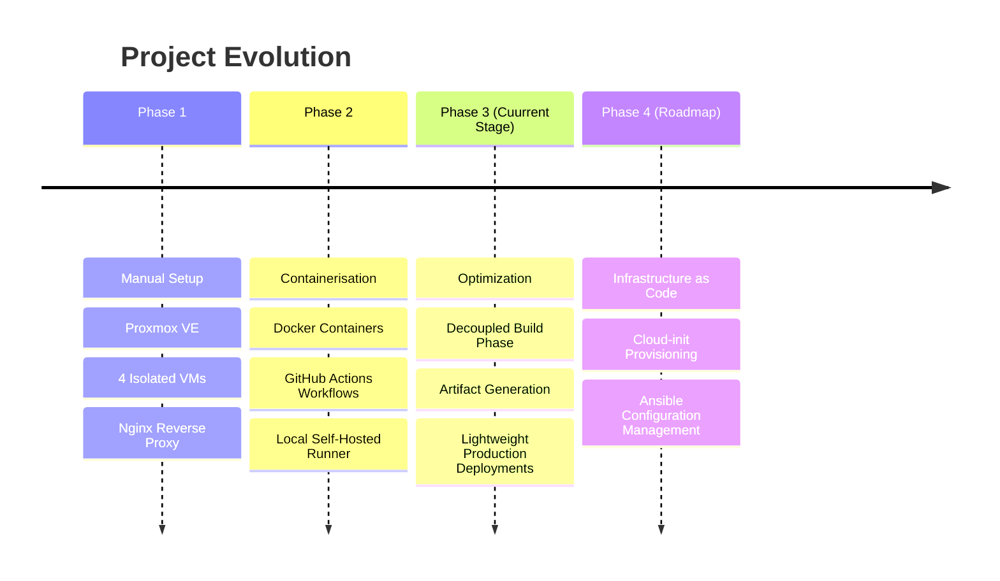

# SamplePhotoApp
Sample Photo App - For Training

## Project Overview & Evolution
The Mission: To build a containerised, and automated multi-tier web application infrastructure.

## The Growth: 
Evolved the setup from manual Proxmox VMs (Phase 1) to Docker containerisation with GitHub Actions (Phase 2), and finally optimizing it into a decoupled, artifact-based CI/CD pipeline (Phase 3).

## Future Plans
    Ansible (Configuration Management / Automation tool)cload-init 
    Cloud-init (Industry-standard multi-distribution drive initialization)easly recreatable sample
    Highly reproducible, immutable infrastructure or automated provisioning template

## See Progress Log
[Proggress Log](https://github.com](https://github.com/simcheckland-ship-it/SamplePhotoApp/wiki/My-Progress-Log-and-Notes))

